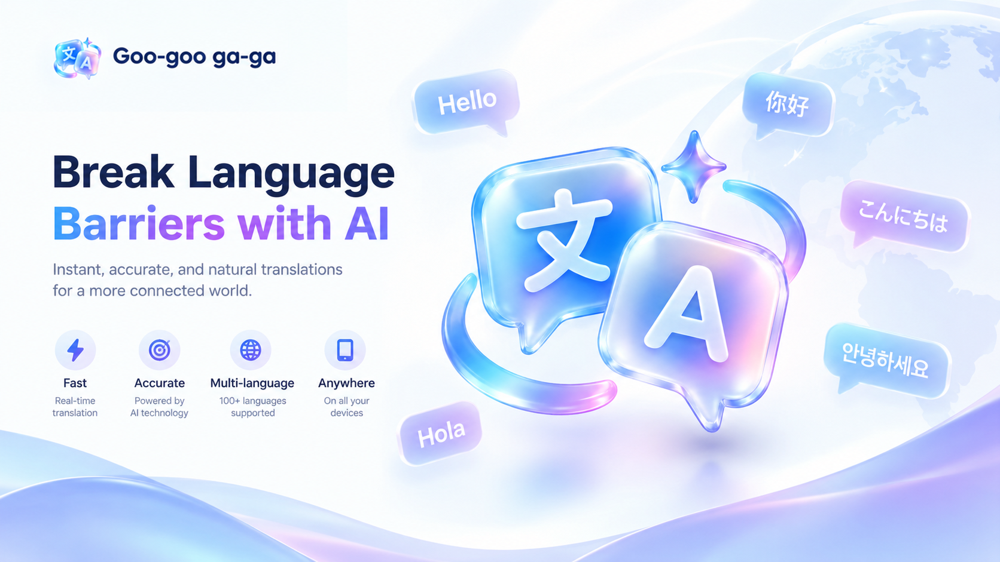

<p align="center">
  
</p>

<p align="center">
  <strong>Break language barriers with contextual AI translations, cultural nuances, and subtitle localization.</strong>
</p>

<p align="center">
  
  
  
  
  
  
  
  
</p>

---

## 📖 Overview

**Goo-goo ga-ga** (LinguaSense AI) is a powerful, modern, open-source Android translation application powered by **Google Gemini** and offline on-device language detection with **Lingua**. 

Unlike conventional machine translation tools that deliver literal word-for-word output, **Goo-goo ga-ga** comprehends context, tone, idioms, cultural references, and subtext. Whether you are translating daily conversations, academic texts, or entire movie subtitle tracks, Goo-goo ga-ga ensures your translations sound natural and culturally nuanced.

---

## 📱 Screenshots

<div align="center">
  <table border="0">
    <tr>
      <td align="center" width="33%">
        
        <br />
        <sub><b>Direct Translation & Cultural Nuances</b></sub>
      </td>
      <td align="center" width="33%">
        
        <br />
        <sub><b>Searchable Local History</b></sub>
      </td>
      <td align="center" width="33%">
        
        <br />
        <sub><b>API Key, Models & Directives</b></sub>
      </td>
    </tr>
  </table>
</div>

---

## ✨ Key Features

### 🧠 1. Context-Aware Translation & Cultural Nuances
- **Direct & Fluid Translation**: Preserves formatting, line breaks, and conversational style.
- **Deep Cultural Breakdown**: Decodes slang, idioms, historical references, and regional expressions.
- **Interactive Key Terms**: Tap on highlighted phrases to open an in-depth linguistic explanation sheet.
- **Pronunciation & TTS**: Hear natural pronunciation in multiple target languages.

### 🎬 2. Subtitle & Document Localization
- **Multi-Format Support**: Easily translate `.srt`, `.vtt` subtitles, `.lrc` lyrics, `.json` data files, and `.md` Markdown documents.
- **Token Guard**: Automatically detects non-dialogue sound cues, sound effects `[sighs]`, and noise lines, preserving them untouched without wasting Gemini API tokens.
- **Cinematic & Tone Presets**:
  - 🍿 *Cinematic Standard* (Netflix & HBO spoken style)
  - 🕵️ *Thriller & Crime Drama* (Gritty, cynical, sharp tension)
  - 😂 *Comedy & Sitcom* (Witty timing and adapted banter)
  - 💥 *Action & Blockbuster* (Urgent, tactical brevity)
  - 🌸 *Anime & Asian Drama* (Nuanced honorifics and expressive emotion)
  - 📚 *Documentary & Academic* (Authoritative, precise terminology)
  - ⚙️ *Custom Directives* (Define your own persona and translation guidelines)
- **Character & Storyline Context**: Provide scene plot outlines and up to 15 character personas for consistent tone, gender forms, and pronouns.
- **Checkpoint & Resume**: Interrupt and resume long translation jobs anytime without losing progress.

### ⚡ 3. System-Wide Quick Translation (Process Text)
- Highlight text in any application (browser, chat, document reader) and tap **Gugu gaga** from the context menu.
- Instant floating bottom sheet translation with quick copy, replace, or insight exploration.

### 🌐 4. Offline On-Device Language Detection
- Powered by the high-performance **Lingua** library.
- Detects the source language locally in milliseconds without making unnecessary network calls.
- Warns when source and target languages match to prevent wasted API calls.

### 🔒 5. 100% Privacy-First (Bring Your Own Key - BYOK)
- Direct communication with Google Gemini API — **no middleman servers or third-party tracking**.
- Your Gemini API key and translation records are stored securely on your local device.
- Full local search and one-tap history wipe.

---

## 🛠️ Tech Stack & Architecture

- **UI Framework**: [Jetpack Compose](https://developer.android.com/jetpack/compose) with [Material Design 3](https://m3.material.io/)
- **Programming Language**: [Kotlin](https://kotlinlang.org/) (Coroutines, Flow, StateFlow)
- **AI Backend**: [Google Gemini REST API](https://ai.google.dev/) (`gemini-2.5-flash`, `gemini-2.5-pro`, `gemini-3.1-flash-lite`, etc.)
- **Language Detection**: [Lingua](https://github.com/pemistahl/lingua) (Offline on-device NLP)
- **Local Persistence**: [Room Database](https://developer.android.com/training/data-storage/room) & DataStore / SharedPreferences
- **Networking**: [Retrofit 2](https://square.github.io/retrofit/) + [OkHttp 3](https://square.github.io/okhttp/) + [Moshi](https://github.com/square/moshi)
- **Styling & Effects**: Squircle shapes, Markdown rendering (`multiplatform-markdown-renderer-m3`)

---

## 🚀 Getting Started

### Prerequisites
- [Android Studio Ladybug (2024.2+) or newer](https://developer.android.com/studio)
- JDK 17 or JDK 21
- Android SDK Platform 35 / 37

### 🔑 Getting a Free Gemini API Key
1. Go to [Google AI Studio](https://aistudio.google.com/).
2. Sign in with your Google account.
3. Click **Get API key** and create a new key (free tier available).
4. Enter the key into the app during the onboarding setup or in **Settings**.

### 💻 Build & Run from Source

1. **Clone the repository:**
   ```bash
   git clone https://github.com/buituandev/Googoo-gaga.git
   cd Googoo-gaga
   ```

2. **Configure API Key (Optional for pre-building):**
   Copy the example `.env` file:
   ```bash
   cp .env.example .env
   ```
   Add your Gemini API key inside `.env`:
   ```env
   GEMINI_API_KEY=your_actual_gemini_api_key_here
   ```
   *(Alternatively, you can skip this step and enter your key directly inside the app's Settings screen).*

3. **Open and Build in Android Studio:**
   - Open Android Studio and select **Open**, then choose the project root directory.
   - Let Gradle sync dependencies.
   - Select your target device or emulator and click **Run (Shift + F10)**.

4. **Or build via Gradle CLI:**
   ```bash
   # Debug APK
   ./gradlew assembleDebug

   # Release APK
   ./gradlew assembleRelease
   ```

---

## 🤝 Contributing

Contributions, issues, and feature requests are welcome!

1. Fork the Project
2. Create your Feature Branch (`git checkout -b feature/AmazingFeature`)
3. Commit your Changes (`git commit -m 'feat: Add some AmazingFeature'`)
4. Push to the Branch (`git push origin feature/AmazingFeature`)
5. Open a Pull Request

---

## 📄 License

This project is licensed under the [GNU General Public License v3.0](LICENSE).

---

<p align="center">
  Made with ❤️ by <a href="https://github.com/buituandev">buituandev</a>
</p>
